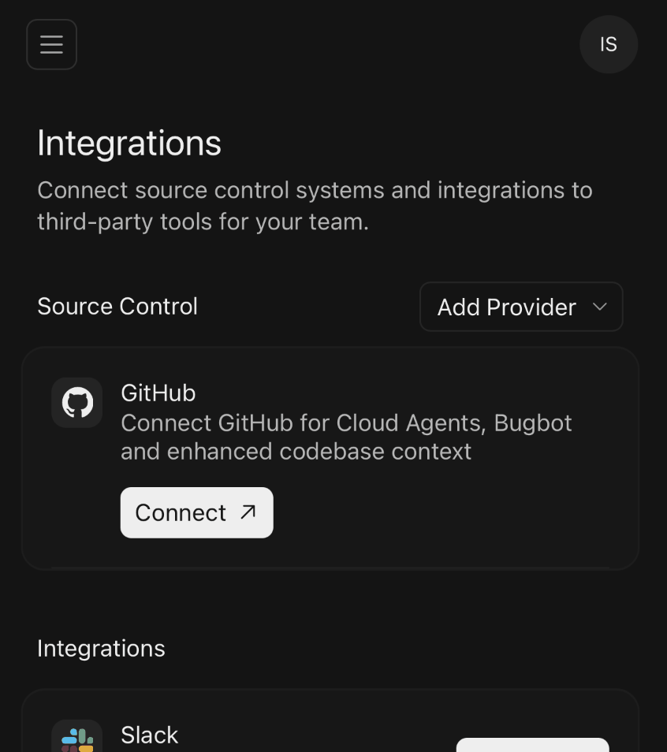
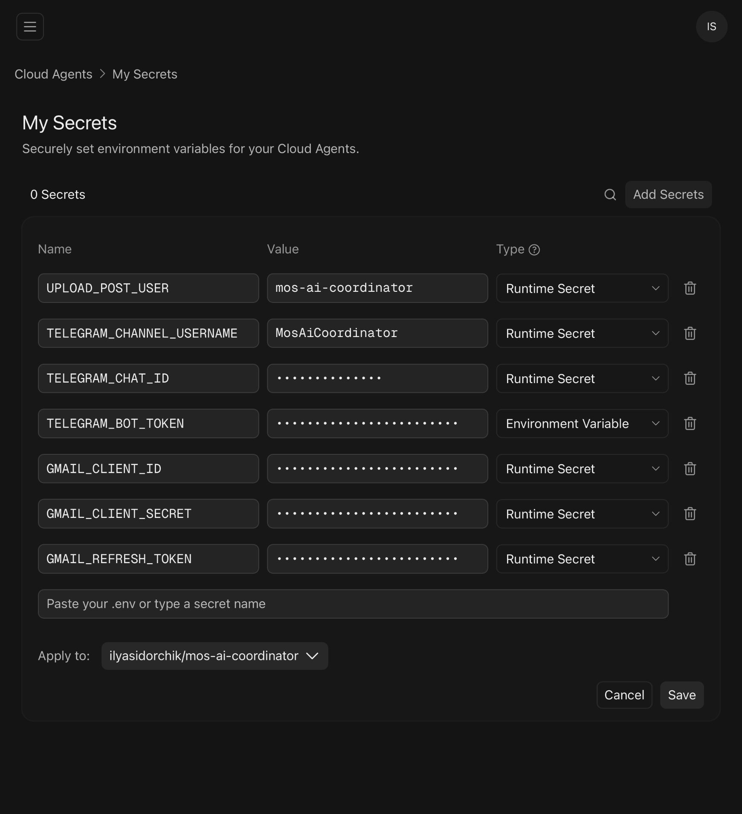

# AI-помощник для подачи обращений на mos.ru

Писать обращения самому — долго, со временем пропадает мотивация. В современном мире есть более эффективный способ — с помощью нейросетей.

AI-агент создаёт черновик, учитывает историю ответов, помогает при написании, готовит фото и текст и заполняет форму на портале. Затем сам проверяет почту и сохраняет ответ «пдфкой» и текстом.

Обращение без AI-агента получает «отписку», с AI — меняет город к лучшему.


- [Мотивация](#мотивация)
- [Как скачать](#как-скачать)
- [Как настроить](#как-настроить)
- [Как работать](#как-работать)
  - [Подача обращения](#подача-обращения)
  - [Сохранение ответа на обращение](#сохранение-ответа-на-обращение)
- [Шаблоны](#шаблоны)
- [Об авторе](#об-авторе)


## Мотивация

Наша цель — не спам, а помощь госслужащим, чтобы обращение хотелось взять в работу (отрывок [об этом на Ютубе](https://youtu.be/RFm7D2nfKvc?t=4677)).

На обращение может прийти формальный ответ, это нормально. «Если напишет 5 человек — задумаются; если 10, — скорее всего, возьмут в работу; если 20, 30 и больше — точно возьмут в работу и, скорее всего, сделают» — © Андрей Мухортиков, начальник отдела оптимизации транспортных потоков в ЦОДДе Москвы ([отрывок на Ютубе](https://youtu.be/RFm7D2nfKvc?t=4798))

Поэтому смело повторяйте обращения других горожан.

*Примечание.* Одна проблема — одно обращение. Например, если пожаловаться на несколько неправильных ливневых решёток на велополосе, то исправят только одну, поэтому нужно отдельное обращение на каждую решётку.


## Как настроить

1. Входим в свой аккаунт на Гитхабе.
2. Нажимаем на этой странице кнопку Fork.

В результате копия репозитория появится на вашем аккаунте на Гитхабе.


### На телефоне

> Все следующие шаги делаем с включённым «КВН»

1. На iOS скачиваем мобильное приложение [Cursor](https://cursor.com/mobile),
на Android переходим [на сайт Cursor](https://cursor.com/agents).

2. Регистрируем аккаунт в Cursor на почту Gmail. Если потребуется подтвердить номер телефона, вводим номер РФ, на него пока что приходят СМС с кодами.

3. Добавляем репозиторий на Гитхабе в Cursor [на странице интеграций](https://cursor.com/dashboard/integrations):

   

4. Добавляем секреты в Cursor [в Cloud Agents · My Secrets](https://cursor.com/dashboard/cloud-agents?view=my-secrets):

   

```
# --- Telegram ---
# Нужен, чтобы агент делился запросами и ответами
# Создаём бота через @BotFather и Телеграм-канал, делаем бота админом
# Токен бота, полученный от @BotFather
TELEGRAM_BOT_TOKEN=

# Телеграм-канал: @username или числовой id (например, -1001234567890, узнаётся через @userinfobot)
TELEGRAM_CHAT_ID=

# Публичный username канала без @ (для ссылок на пост: https://t.me/<name>/<post_id>)
#! Задаём этот ключ как Environment Variable
TELEGRAM_CHANNEL_USERNAME=


# --- Gmail ---
# Нужен, чтобы агент разбирал почту
GMAIL_CLIENT_ID=
GMAIL_CLIENT_SECRET=
GMAIL_REFRESH_TOKEN=
```

#### Где взять секреты для Gmail

Это будет выглядеть страшно, но это несложно.

- Заходим под тем же Gmailна сайт [Google Cloud Console](https://console.cloud.google.com/)
- Создаём проект
- Включаем **Gmail API**: APIs & Services → Library → Gmail API → Enable.
- Настраиваем **OAuth consent screen**: User type — External; App name и email — любые свои; статус — Testing; в Test users добавляем свой Gmail.
- **Credentials → Create credentials → OAuth client ID**: Application type — Desktop app; копируем те самые секреты, Client ID и Client Secret.

`GMAIL_REFRESH_TOKEN` получим, когда первый раз попросим агента проверить почту. Но этот токен живёт ≈7 дней, просто придётся переходить по ссылке из чата для обновления и всё.


5. [В чате](https://cursor.com/agents) пишем агенту `/fork-cleanup` или «Подготовь форк» — он удалит обращения и ответы автора, оставит несколько кейсов-образцов, обнулит статистику и сохранит изменения.

Дальше даём агенту задания, см. примеры ниже.


### На компьютере

Клонируем **свой** форк себе на компьютер (кнопка Code → SSH). Как связать компьютер и Гитхаб: [гайд](https://docs.github.com/ru/authentication/connecting-to-github-with-ssh).

Нам нужен текстовый редактор с умным автодополнением и встроенным чатом с AI-ассистентом. Варианты:

- [Cursor](https://cursor.com/) (рекомендуется)
- VS Code с расширением Copilot от GitHub и Codex от ChatGPT
- Windsurf с расширением Claude Code

Я работаю в Cursor, для меня он самый удобный: больше полезного места, чем в VS Code, я выделяю строчку через `⌘L` и спрашиваю агента, перетаскиваю файлы в чат, браузер из коробки, интерфейс ответа, под капотом те же модели при желании (у меня выбрано Auto). Есть бесплатная версия, но с подпиской больше возможностей. Без VPN.

После клонирования репозитория один раз пишем агенту `/fork-cleanup` или «Подготовь форк» — он удалит обращения и ответы автора, оставит несколько кейсов-образцов, обнулит [статистику](./statistics.md) и сохранит изменения.


## Как работать
### Подача обращения

> Весь процесс на видео: [youtu.be/yjfT8NWzpsc](https://youtu.be/yjfT8NWzpsc)

1. `/new` или `Создай обращение`

Открываем встроенный в редактор чат и пишем агенту `/new` с описанием проблемы — он создаст папки и спросит, набрасывать ли черновик. Пример:

> `/new` в СВАО: автобус 605 нарушил интервал движения на 5 минут такого-то числа на такой-то остановке. Спроси почему и попроси принять меры.

Дальше пишем обращение, используя чат в редакторе как помощника: набросать черновик, сформулировать мысль, добавить аргументы, факты, примеры из мирового опыта, проверить факты, найти статистику, предположить эффективность обращения.

Затем делаем рутину, но не руками, а командами:

2. `/prepare-request` или `Подготовь обращение`
Агент переименует добавленные фото по шаблону, вытащит из них дату съёмки, сожмёт до менее 5 МБ, проверит текст на орфографию, фактические ошибки и оттипографирует (добавит неразрывные пробелы, кавычки-«ёлочки» и длинные тире).

4. `/submit-request` или `Отправь обращение`
Агент сам откроет встроенный браузер в Cursor и заполнит форму на mos.ru, вы приложите фото, сами отправите форму и запишите номер обращения.

6. `/save` или `Сохранись`
Агент сделает коммит из контекста изменений и запушит на Гитхаб.


### Сохранение ответа на обращение

`/mail-inbox` или `Разбери почту`
Если ответы приходят на Gmail (письма от `sedo@mos.ru` или пересылки с темой «Ответ … на обращение гражданина»), пишем агенту `/mail-inbox` — он через скрипт скилла проверит почту, скачает PDF в проект в папку `inbox/` и сам запустит `/inbox` (см. дальше). Нужен заполненный `.env` с ключами Gmail (пример — [`.env.example`](.env.example)). С телефона в Cloud Agents те же ключи задаются как Secrets в дашборде Cursor. Если refresh-токен протух (OAuth app в Testing ≈7 дней), локально: `node .codex/skills/mail-inbox/scripts/auth.mjs`, затем обновить `GMAIL_REFRESH_TOKEN` в `.env` и в Secrets.

`/inbox`
Мы сами скачиваем PDF-файл ответа из электронного письма, перемещаем его в папку `inbox` и пишем в чате `/inbox` — агент перенесёт «пдфку» в нужный кейс в папку `response/` и продублирует текстом.

`/telegram`
Когда в `response/photos/` есть фото результата, пишем `/telegram` и перетаскиваем кейс в чат — агент отправит фото и подпись (итог, округ и адрес, координаты) в Телеграм-канал через скрипт скилла. Нужен заполненный `.env` (токен бота, id канала и username; пример — [`.env.example`](.env.example)). С телефона в Cloud Agents те же ключи задаются как Secrets в дашборде Cursor.

> Пример серии обращений по поводу добавления наземного перехода — [SVAO/pedestrian-crossings/zapovednaya](SVAO/pedestrian-crossings/zapovednaya/)


## Шаблоны

Ниже собраны темы, по которым, скорее всего, примут меры. По возможности будут добавлены шаблоны (указывайте их агенту).

- на велополосе ливневая решётка, в которой застревает велосипед [шаблон](.templates/bike-friendly-drain-grate/),
- автомобиль на велополосе под знаком 3.27 «Остановка запрещена» [шаблон](.templates/bike-lane-car-no-stopping/),
- наземный пешеходный переход на месте сложившегося пешеходного потока [шаблон](.templates/zebra/),
- автобус не пришёл вовремя,
- островок безопасности через дорогу больше одной полосы в одну сторону,
- дополнительная полоса движения за счёт сужения полос и переразметки,
- «вафельная» разметка на интенсивных перекрёстках,
- снижение скоростного режима рядом со школой.


---

## Об авторе

Я Илья Сидорчик, москвич из Южного Медведкова, фронтенд-разработчик (ex Авито, Яндекс), тревел-блогер, урбанист.

Хобби: велосипед, вейксёрфинг, гольф, английский язык (британский акцент), французский язык, недвижимость, дизайн интерьера.

- Мой телеграм: [@ilyasidorchik](https://t.me/ilyasidorchik)
- Тревел-блог на Ютубе: [@worthseeingworld](https://youtube.com/@worthseeingworld)
- Велопоездки на Ютубе: [@moscowbikeridepov](https://youtube.com/@moscowbikeridepov)
